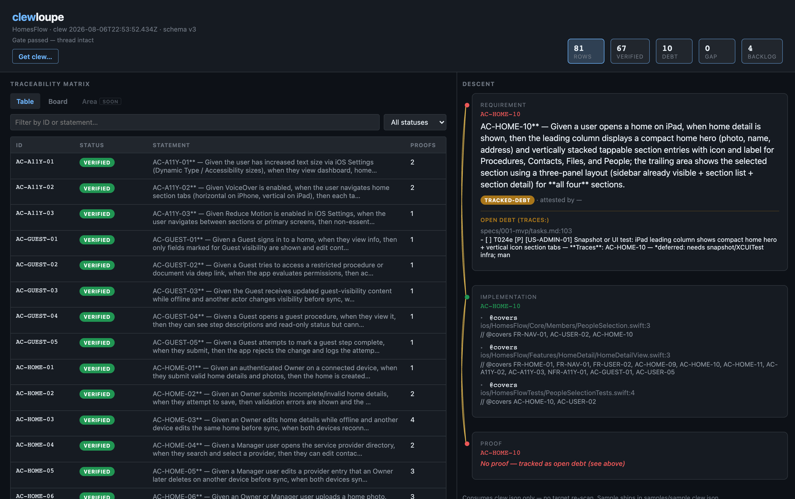
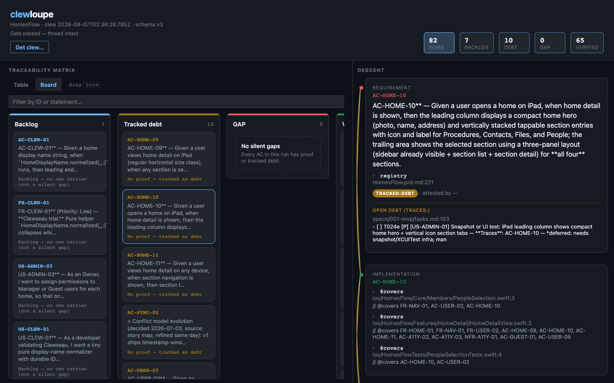
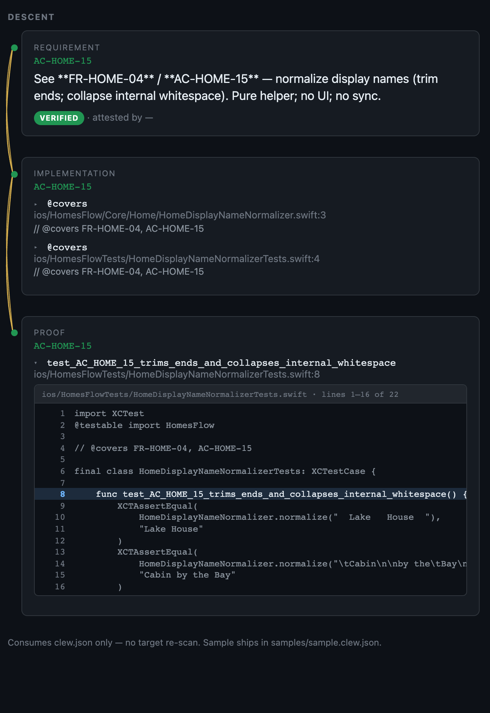
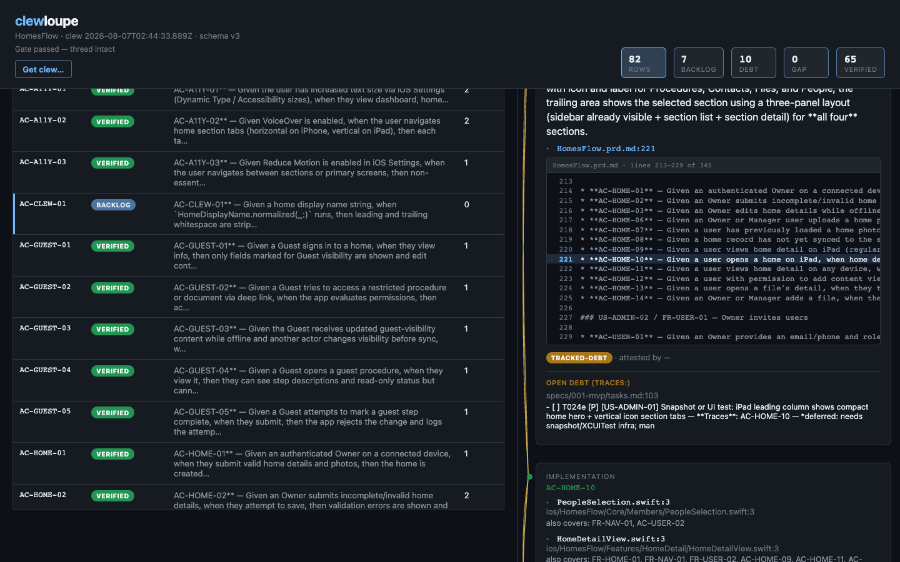
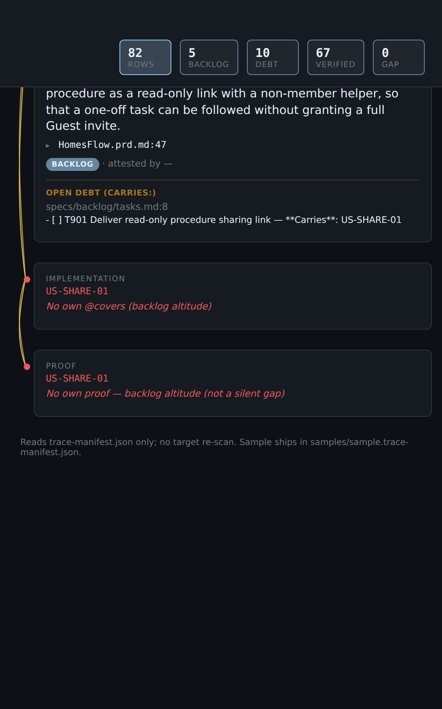
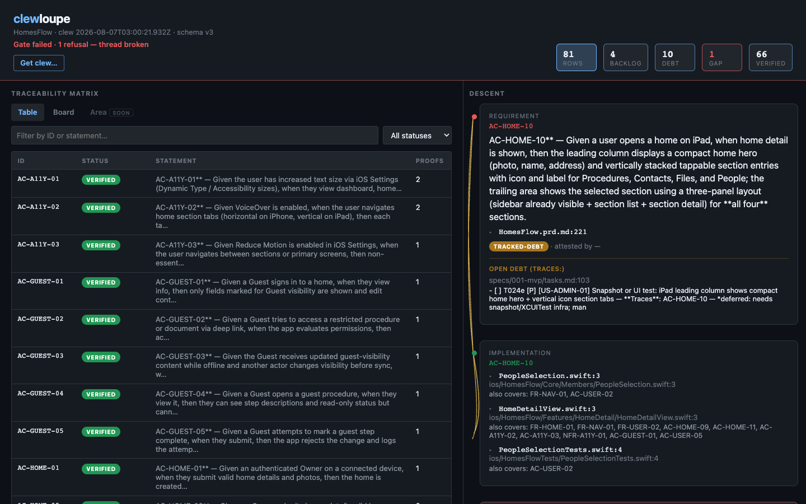
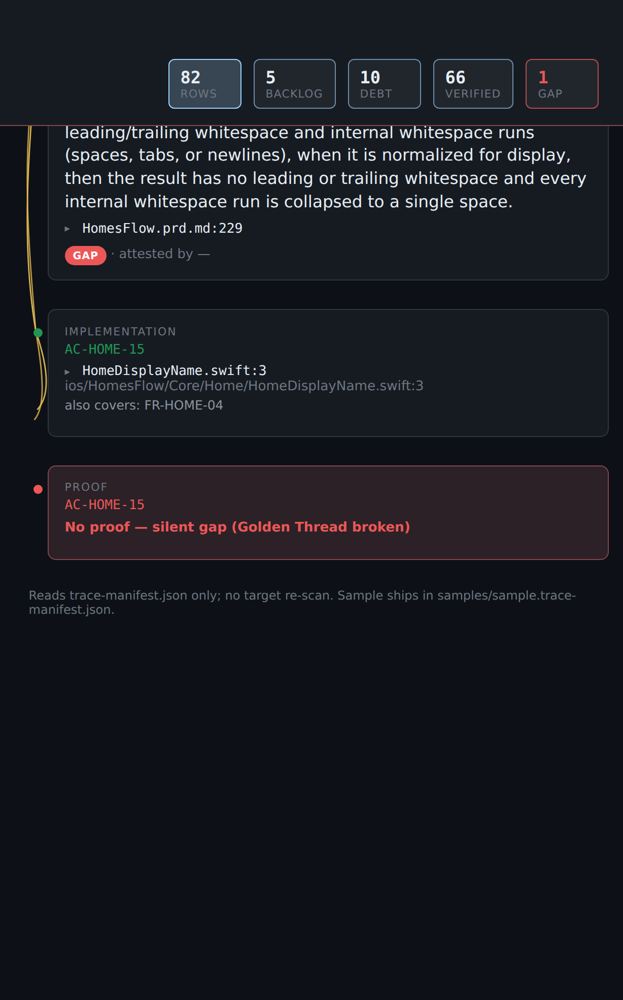
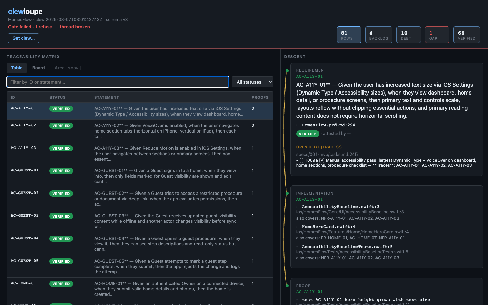

# clewloupe field guide

What you are looking at when you open a clew in **clewloupe**, in plain English, one screenshot at a time.

This is the visual companion to [`reading-a-clew.md`](./reading-a-clew.md), which tells the same story in SDLC terms. Vocabulary is locked in [`../presets/clewseau/GLOSSARY.md`](../presets/clewseau/GLOSSARY.md).

**Voice note:** the check script is the **Gate**; what the human sees is the **Thread**. Prefer "the Thread is intact / broken" in narrative. Say "Gate" when you mean the script that judged it.

## Where these pictures came from

The Thread-intact captures are a real render of HomesFlow's live Gate 2 emit — 82 durable IDs, the same emit shipped as [`../samples/homesflow.clew.json`](../samples/homesflow.clew.json). No hand-edited JSON.

The three Thread-broken captures (section 6) came from a deliberate break in a scratch copy of the trial tree: one test was renamed so its acceptance criterion lost its named proof while no open task claimed it. Gate was re-run for real, refused for real, and the scratch copy was deleted afterward. The refusal is honest; only the break was staged.

## 1. The top bar: is the Thread intact?

Before reading any row, the top bar answers the only global question:

- **Thread intact.** The clew contains zero hidden unfinished work. Not zero unfinished work; zero *hidden* unfinished work.
- The stat tiles read left to right: **Rows** (all durable IDs), then **Backlog → Debt → Verified** — waiting, excused, proven — with **GAP** last. GAP is the least-populated status, so on tight horizontal space it never crowds out busier tiles; when it is nonzero it still screams. Each tile is a filter button.
- The `GAP` tile only lights up red when GAPs exist. Here it reads 0, which is why the Thread is intact.
- **Get clew…** loads any other `*.clew.json` file. The loupe never re-scans a repo; it only reads what Gate emitted.

## 2. Board lens: the four buckets

Same rows, partitioned by status in the same order:

- **Backlog**: minted and waiting — planning-altitude stories and features without their own carrier, plus anything anointed into backlog (section 5). Not a defect.
- **Tracked debt**: not done, and the team said so on an open task. Honest yellow.
- **Verified**: proof exists. Each card counts its proofs.
- **GAP**: last and usually empty, and the column says why. When this column has cards, the Thread is broken.

## 3. The Descent: one thread, three tiers

Click any row and the right pane walks its golden thread top to bottom:

- **Requirement**: the durable ID and its statement, plus a **▸ file:line** toggle (e.g. `HomesFlow.prd.md:258`) that expands to the actual PRD/registry source around the line where the ID was minted.
- **Implementation**: every `@covers` carrier found in source. Each is labeled with the carrier's **file basename and line** (e.g. `HomeDetailView.swift:3`), with the full path below and an "also covers: …" line naming the other IDs that share the same annotation. Each expands to the real code around it.
- **Proof**: named tests that encode the ID (for ACs), labeled by test name with the path below, expandable the same way.

**`@covers` in one breath.** In source (and sometimes in tests), a comment like `// @covers AC-GUEST-01, FR-HOME-03` is a **beacon**: the author tagging that code as work toward those durable IDs. Gate reads those lines; it never writes them. Clewloupe shows them under Implementation. Closest cousin on the task side is `**Traces**:` on an open checkbox — same idea, different altitude (debt or anointed backlog instead of code). Neither is a runtime annotation; both are claims the Thread can check.

Every claim in the descent can be opened to the file and line that backs it — requirement included. The braided line down the left side is the Thread itself. Its two states matter more than any color: **solid** means the Thread holds; **frayed** means it is broken.

### A verified AC, proof and all

`AC-GUEST-01` end to end: the requirement statement with its registry line (`HomesFlow.prd.md:258`), six `@covers` carriers each labeled by file and line, and a named proof `test_AC_GUEST_01_guest_fields_only`, expanded to the real test code. Green nodes, solid braid. This is what "verified" means: a named artifact you can open, not "the tests passed once."

Note this verified row also carries an **Open debt (Traces:)** block — an XCUITest still open on `T064`. Verified with additional open work is a normal, honest state.

### Tracked debt: red, but nothing is hidden

`AC-HOME-10` is not done, and the clew shows exactly who says so:

- The registry expand (**▸ HomesFlow.prd.md:221**) is open: the PRD source around that line, the requirement in its own words.
- The **Open debt (Traces:)** block names the literal open checkbox task (`T024e`, snapshot/UI test deferred until test infra exists) that claims this ID.
- Implementation is green: `@covers AC-HOME-10` carriers exist in source. Proof is red but the braid stays solid.

Red without fray is the loupe's way of saying *incomplete but excused*. The work is visible on an open task, so it is not a silent gap and the Thread stays intact.

## 4. Anointed backlog: minted on purpose, carried by a TODO

Minting an ID is a promise, and the Gate holds you to it immediately: an ID claimed nowhere fails exact-set as drift. The deliberate way to mint ahead of the work is **anointed backlog** — mint the ID and write one open `Traces:` TODO for it (conventionally `specs/backlog/tasks.md`).

Here `AC-CLEW-01` shows exactly that state: status **BACKLOG** (an AC, and still not a GAP — the TODO means it is not *silent*), the registry expand showing the PRD line it was minted on, and the Open debt block naming `T900`, the TODO that carries it. Zero carriers in code, zero proofs, Thread intact. Delete that TODO without picking up the work and the next Gate run fails exact-set — the Thread will not carry an unclaimed promise.

Filter tile `Backlog` reads 7: four planning-altitude stories plus the three anointed CLEW IDs.

## 5. Backlog altitude: waiting, not broken

Stories and features (`US-…`, `FR-…`, `NFR-…`) are covered through their child ACs, not by stapling `@covers US-…` onto a file. When they have no carrier of their own, they ride as backlog: red nodes, solid braid, and the Proof tier spells it out — "backlog altitude (not a silent gap)." Silent-gap refusal is AC-only.

## 6. Thread broken: what frays and what does not

The scratch tree after the staged break. Three things change at once:

- The banner goes red: **Thread broken · 1 refusal.**
- The **GAP tile goes hot: 1.** Verified dropped by one; that row moved to GAP.
- Rows with no proof now fray, because the clew as a whole can no longer vouch for them.

### The GAP row itself

`AC-HOME-15`, the broken strand. Implementation carriers still exist, but the named proof is gone and no open task claims the ID. The braid **frays between Implementation and Proof**, and the Proof tier says why: "No proof — silent gap (thread broken)." This is the one situation the Thread will not carry: unfinished work that nothing durable admits to. (Technically: Gate refuses.)

### Verified rows stay green even while the Thread is broken

`AC-A11Y-01` during the same broken run: named proofs exist, so its Proof tier stays green and its braid stays solid. A break elsewhere does not un-verify this row's evidence.

## Rules of thumb

| You see | It means |
|---|---|
| Solid braid, green nodes | Thread holds; proof exists |
| Solid braid, red node(s) | Incomplete but excused: tracked debt or backlog altitude |
| Open debt (Traces:) block | The exact open task that excuses (or carries) the incompleteness |
| ▸ file:line / ▸ test name | Expand to the actual source behind the claim |
| Frayed braid | Thread broken: silent gap, or the clew was refused as a whole |
| Red banner, hot GAP tile | At least one AC has neither proof nor admitted debt |

One sentence version: **green is proven, red-on-solid is honest debt, fray is a broken Thread.**
