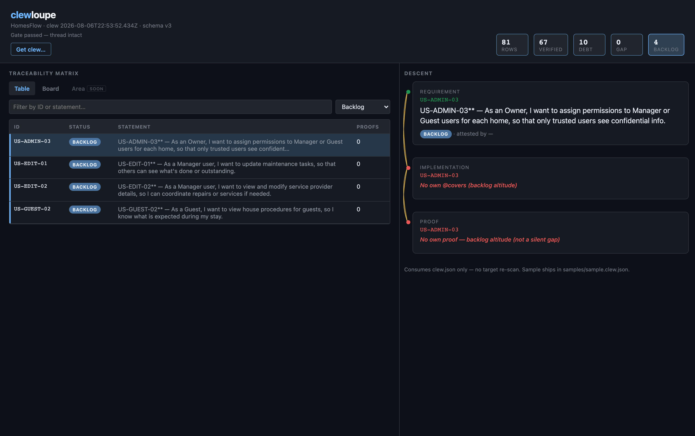

# clewloupe field guide

What you are looking at when you open a clew in **clewloupe**, in plain English, one screenshot at a time.

This is the visual companion to [`reading-a-clew.md`](./reading-a-clew.md), which tells the same story in SDLC terms. Vocabulary is locked in [`../presets/clewseau/GLOSSARY.md`](../presets/clewseau/GLOSSARY.md).

## Where these pictures came from

Every capture is a real render of a real Gate 2 emit against the HomesFlow trial tree (stock Spec Kit plus the Clewseau bundle), the same emit shipped as [`../samples/homesflow.clew.json`](../samples/homesflow.clew.json). No hand-edited JSON.

The two "Gate failed" captures (sections 6 and 7) came from a deliberate, temporary break: one test was renamed so its acceptance criterion lost its named proof while its debt task was already closed. Gate was re-run for real, refused for real, and the tree was restored afterward. The refusal is honest; only the break was staged.

## 1. The top bar: is the thread intact?

Before reading any row, the top bar answers the only global question:

- **Gate passed — thread intact.** The clew contains zero hidden unfinished work. Not zero unfinished work; zero *hidden* unfinished work.
- The stat tiles are the inventory: **Rows** (all durable IDs), **Verified**, **Debt**, **GAP**, **Backlog**. Each tile is a filter button.
- The `GAP` tile only lights up red when GAPs exist. Here it reads 0, which is why the Gate passed.
- **Get clew…** loads any other `*.clew.json` file. The loupe never re-scans a repo; it only reads what Gate emitted.

## 2. Board lens: the four buckets

Same rows, partitioned by status. This is the "where does work stand" view:

- **Verified**: proof exists. Each card counts its proofs.
- **Tracked debt**: not done, and the team said so on an open task. Honest yellow.
- **GAP**: empty here, and the column says why: "Every AC in this run has proof or tracked debt." When this column has cards, the Gate has failed.
- **Backlog**: stories and features that have no carrier of their own yet. Planning altitude, not a defect.

## 3. The Descent: one thread, three tiers

Click any row and the right pane walks its golden thread top to bottom:

- **Requirement**: the durable ID and its statement, straight from the PRD/registry, plus its status badge.
- **Implementation**: every `@covers` carrier found in source, with file and line.
- **Proof**: named tests that encode the ID (for ACs), expandable to the actual source lines.

The braided line down the left side is the thread itself. Its two states matter more than any color: **solid** means the thread holds; **frayed** means it is broken.

### A verified AC, proof and all

`AC-HOME-15` end to end: the requirement statement, two `@covers` carriers, and a named proof `test_AC_HOME_15_trims_ends_and_collapses_internal_whitespace`, expanded to show the real test code. All three nodes green, braid solid. This is what "verified" means: a named artifact you can open, not "the tests passed once."

### Tracked debt: red, but nothing is hidden

`AC-HOME-10` is not done, and the clew shows exactly who says so:

- The Requirement tier carries the **Open debt (Traces:)** block: the literal open checkbox task (`T024e`, snapshot/UI test deferred until test infra exists) that claims this ID.
- Implementation is green: `@covers AC-HOME-10` carriers exist in source.
- Proof is **red but the braid stays solid**: "No proof — tracked as open debt (see above)."

Red without fray is the loupe's way of saying *incomplete but excused*. The work is visible on an open task, so it is not a silent gap and the Gate does not refuse.

### Backlog: waiting, not broken

Filter to Backlog and pick a story. `US-ADMIN-03` has no `@covers` and no proof of its own, and that is fine: stories and features are covered through their child ACs, not by stapling `@covers US-…` onto a file. The nodes are red, the braid is solid, and the Proof tier spells it out: "backlog altitude (not a silent gap)." Silent-gap refusal is AC-only.

## 4. Gate failed: what breaks and what does not

The same tree after the staged break. Three things change at once:

- The banner goes red: **Gate failed · 1 refusal — thread broken.**
- The **GAP tile goes hot: 1.** Verified dropped from 67 to 66; that one row moved to GAP.
- Rows with no proof now fray, because the clew as a whole can no longer vouch for them.

### The GAP row itself

`AC-HOME-15` again, now the broken strand. Implementation carriers still exist, but the named proof is gone and no open task claims the ID. The braid **frays between Implementation and Proof**, and the Proof tier says why: "No proof — silent gap (thread broken)." This is the one situation Gate refuses outright: unfinished work that nothing durable admits to.

### Verified rows stay green even while the Gate is red

`AC-A11Y-01` during the same failed run: named proofs exist, so its Proof tier stays green and its braid stays solid. A Gate refusal elsewhere does not un-verify this row's evidence. Note this row also carries an Open debt block (a manual accessibility pass still open on `T069a`); verified with additional open work is a normal, honest state.

## Rules of thumb

| You see | It means |
|---|---|
| Solid braid, green nodes | Thread holds; proof exists |
| Solid braid, red node(s) | Incomplete but excused: tracked debt or backlog altitude |
| Open debt (Traces:) block | The exact open task that excuses the incompleteness |
| Frayed braid | Thread broken: silent gap, or Gate refused clew-wide |
| Red banner, hot GAP tile | At least one AC has neither proof nor admitted debt |

One sentence version: **green is proven, red-on-solid is honest debt, fray is a lie the Gate caught.**
